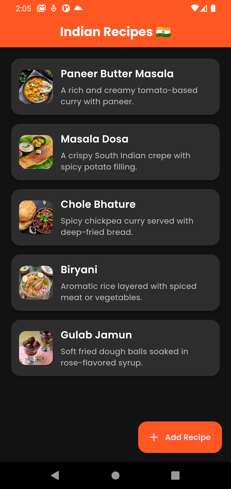

# 🍛 Indian Food Recipe App

A beautifully designed Flutter app to browse, add, and view popular Indian food recipes with images, ingredients, and step-by-step instructions.

---

## ✨ Features

- 🏠 Home screen listing all added recipes
- ➕ Add recipe with title, description, ingredients, steps, and image URL
- 📄 Detailed view with beautiful UI and food image
- 📱 Responsive & adaptive layout
- 💾 State management using Provider
- 🖋 Google Fonts for enhanced typography

---

## 📸 Screenshots

| Home Screen | Recipe Detail | Add Recipe |
|-------------|---------------|-------------|
|  |  |  |

> *(Add your own screenshots by replacing the image links)*

---

### 🧰 Dependencies

```yaml
dependencies:
  flutter:
    sdk: flutter
  cupertino_icons: ^1.0.8
  provider: ^6.1.5
  google_fonts: ^6.1.0
```


## 🧑‍🍳 Sample Recipes Preloaded

```json
[
  {
    "title": "Paneer Butter Masala",
    "description": "Creamy and flavorful paneer curry.",
    "imageUrl": "https://www.cubesnjuliennes.com/wp-content/uploads/2020/07/Paneer-Butter-Masala-Recipe.jpg"
  },
  {
    "title": "Masala Dosa",
    "description": "Crispy dosa filled with spicy potato mash.",
    "imageUrl": "https://www.indianhealthyrecipes.com/wp-content/uploads/2021/08/masala-dosa-recipe.jpg"
  }
]
````

---

## 🧑‍💻 Tech Stack

* **Flutter** with Dart
* **Provider** for state management
* **Google Fonts** for UI typography
* **Material Design** for UI components

---

## 🚀 Getting Started

1. **Clone this repo**

   ```bash
   git clone https://github.com/laxmibagade/food-recipe-app.git
   ```

2. **Navigate to the project directory**

   ```bash
   cd indian-food-recipe-app
   ```

3. **Install dependencies**

   ```bash
   flutter pub get
   ```

4. **Run the app**

   ```bash
   flutter run
   ```

---

## 🛠 Folder Structure

```
lib/
│
├── models/
│   └── recipe.dart
│
├── providers/
│   └── recipe_provider.dart
│
├── screens/
│   ├── home_screen.dart
│   ├── add_recipe_screen.dart
│   └── recipe_detail_screen.dart
│
├── widgets/
│   └── recipe_card.dart
│
└── main.dart
```


